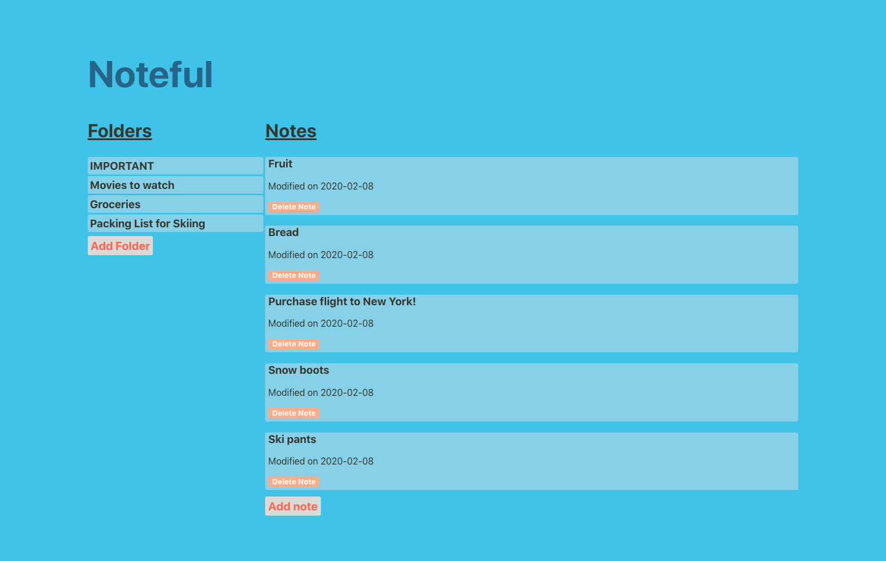
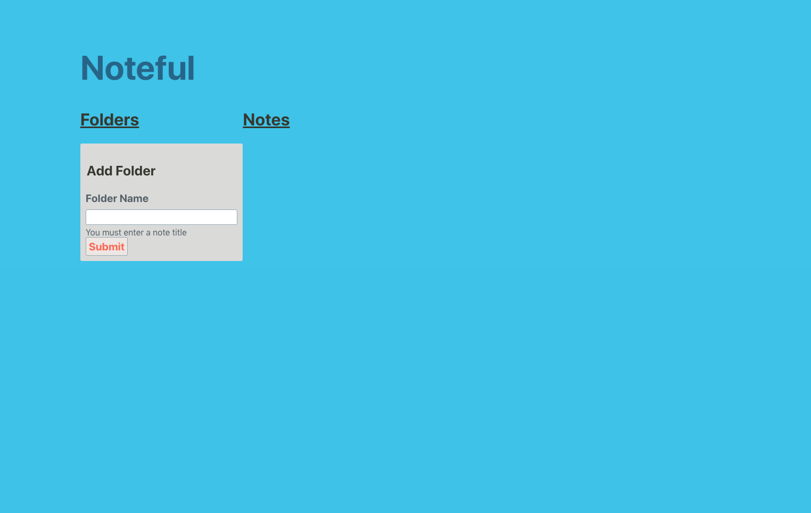
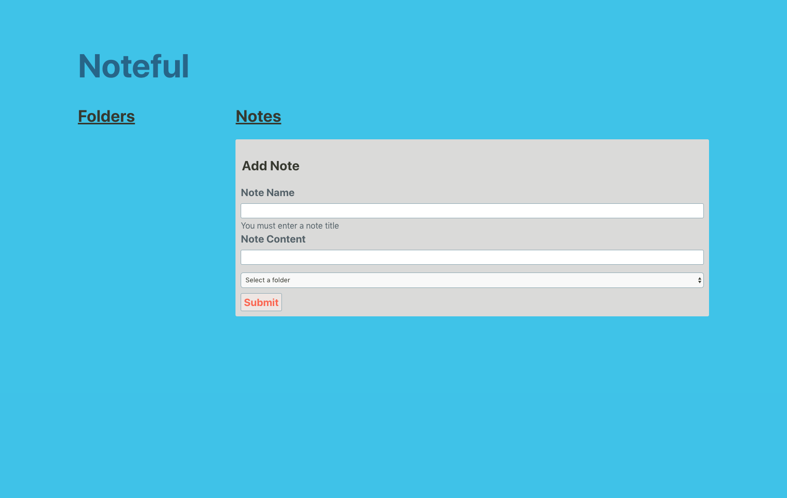
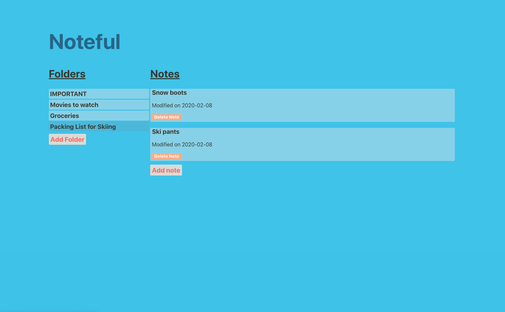

# Noteful

Note-taking application, the user can add/delete notes and organize them in folders.

## Working Prototype
[Noteful API Repo](https://github.com/brandiherrera/noteful-app-server)

[Noteful React Repo](https://github.com/brandiherrera/noteful-app)

[Live Noteful Application](https://noteful-app.brandiherrera.now.sh/)

## Live Screenshots

**Noteful Landing Page**

**Add Folder Page**

**Add Note Page**

**Folder View**

## Technology Used

<b>Front End</b>
* HTML5
* CSS3
* JavaScript
* React
  
<b>Back End</b>
* Node.js
* Express.js
* PostgreSQL

## Scripts

Install node modules `npm install`

Start the application `npm start`